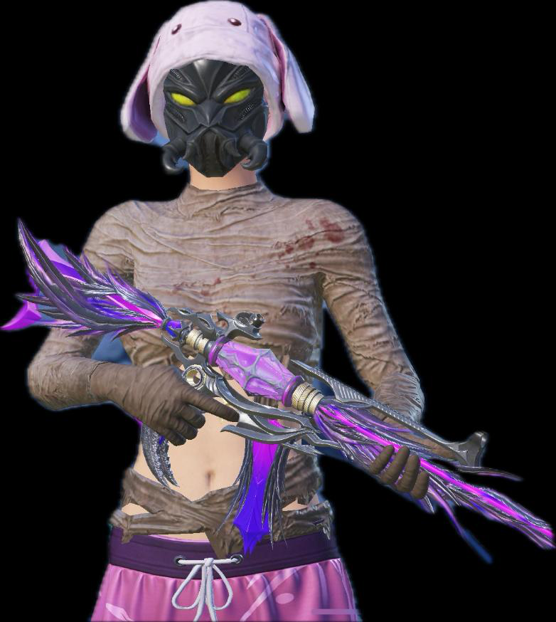

<head>
  <meta charset="UTF-8">
  <meta name="viewport" content="width=device-width, initial-scale=1.0">
  <title>EXILE323</title>
  
</head>
<body>
  <!-- LOADING -->
  

    
    
Yükleniyor...

  

  <!-- HEADER -->
  <header>
    <h1>EXILE323</h1>
    

      

    

    <nav>
      <a href="#hakkimizda">Hakkımızda</a>
      <a href="#liderler">Liderler</a>
      <a href="#basvuru">Başvuru</a>
      <a href="#iletisim">İletişim</a>
    </nav>
  </header>

  <!-- HERO -->
  

    <h2>Für die Famillia</h2>
    
SINCE 2018 - PUBG MOBILE klanımızı temsil eden resmi sayfa

  

  <!-- HAKKIMIZDA -->
  <section id="hakkimizda">
    <h2>Hakkımızda</h2>
    
EXILE323 klanı, 2018’den beri PUBG Mobile sahnesinde aktif olan, disiplin, dostluk ve başarı üzerine kurulmuş bir topluluktur. 
    Her üye bir ailenin parçasıdır ve hedefimiz her zaman birlikte yükselmektir.

  </section>

  <!-- LİDERLER -->
  <section id="liderler">
    <h2>Liderler</h2>
    

      

        
        <h3>EXILE323</h3>
        
ID: 516572604

      

    

  </section>

  <!-- BAŞVURU -->
  <section id="basvuru">
    <h2>Başvuru Formu</h2>
    <form action="https://formspree.io/f/xqalrayd" method="POST">
      <input type="text" name="isim" placeholder="Oyun İsmi" required>
      <input type="text" name="uid" placeholder="UID" required>
      <input type="number" name="yas" placeholder="Yaş" required>
      <input type="text" name="cihaz" placeholder="Cihaz" required>
      <textarea name="aktiflik" placeholder="Aktiflik durumun" rows="3"></textarea>
      <button type="submit">Başvur</button>
    </form>
  </section>

  <!-- İLETİŞİM -->
  <section id="iletisim">
    <h2>İletişim</h2>
    
TikTok: <a href="https://www.tiktok.com/@exile323" target="_blank">@exile323</a>

  </section>

  <!-- FOOTER -->
  <footer>
    Für die Famillia | SINCE 2018
  </footer>

  
</body>
</html>
