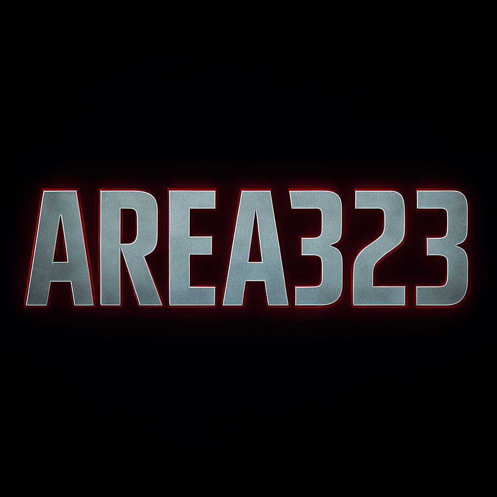

<head>
  <meta charset="UTF-8" />
  <meta name="viewport" content="width=device-width, initial-scale=1" />
  <title>AREA323</title>
  <meta name="theme-color" content="#0a0a0a" />
  
</head>
<body>
  <!-- Preloader -->
  

    

  
  <!-- BG effect -->  

  <!-- Navbar -->  <nav>
    

      
AREA323

      

      <ul class="menu" id="menu">
        <li><a href="#hero">Ana Sayfa</a></li>
        <li><a href="#about">Hakkımızda</a></li>
        <li><a href="#leaders">Liderler</a></li>
        <li><a href="#apply">Başvuru</a></li>
        <li><a href="#tracker">Takip</a></li>
        <li><a href="#contact">İletişim</a></li>
      </ul>
    

  </nav>  <!-- Hero -->  <header id="hero" class="hero">
    

      
      <h1 class="title">Für die Famillia</h1>
      
SINCE 2018 • Beyond Limits

      

        <a class="btn" href="#apply">Klan Başvurusu</a>
        <a class="btn" href="#tracker">Başvuru Takip</a>
      

    

  </header>  <main id="main">
    <!-- Hakkımızda -->
    <section id="about">
      

        

          <h2>Hakkımızda</h2>
          
AREA323, sadece bir klan değil bir aile. 2018’den beri PUBG Mobile sahnesinde aktif olan ekibimiz, disiplin, dostluk ve rekabeti aynı potada eritiyor. Amacımız birlikte büyümek, sahnede en iyiler arasında yer almak ve her maçta takım ruhunu hissettirmek.

        

        

          <h3>Değerlerimiz</h3>
          <ul>
            <li>Takım Ruhu ve Saygı</li>
            <li>Sürekli Gelişim</li>
            <li>Rekabet ve Eğlence Dengesi</li>
          </ul>
        

      

    </section><!-- Liderler -->
<section id="leaders">
  

    

      <h2>Liderler</h2>
      

        

          <h3>EXILE323</h3>
          
<strong>ID:</strong> 516572604

        

        

          <h3>Yakında</h3>
          
Yeni lider veya moderatör eklenecek.

        

      

    

  

</section>

<!-- Başvuru Formu (Formspree) -->
<section id="apply">
  

    

      <h2>Klan Başvurusu</h2>
      <form action="https://formspree.io/f/xqalrayd" method="POST">
        <label>UID
          <input name="uid" type="text" placeholder="Oyun UID" required />
        </label>
        <label>Oyun Nicki
          <input name="nick" type="text" placeholder="Nick" required />
        </label>
        <label>Yaş
          <input name="age" type="number" min="10" max="80" placeholder="18" required />
        </label>
        <label>Cihaz
          <input name="device" type="text" placeholder="iOS / Android / Model" />
        </label>
        <label>Aktiflik
          <select name="activity">
            <option value="gunluk">Günlük</option>
            <option value="haftalik">Haftalık</option>
            <option value="degisken">Değişken</option>
          </select>
        </label>
        <label>Not
          <textarea name="note" rows="3" placeholder="Eklemek istediğin bir şey var mı?"></textarea>
        </label>
        <button class="btn" type="submit">Gönder</button>
      </form>
    

  

</section>

<!-- Başvuru Takip Sistemi (Mock) -->
<section id="tracker">
  

    

      <h2>Başvuru Takip</h2>
      
Başvuru yaptıktan sonra aşağıya UID veya ID girerek durumunu kontrol edebilirsin.

      <form id="trackForm" onsubmit="return false;">
        <label>UID / ID
          <input id="trackId" type="text" placeholder="Örn: 516572604" required />
        </label>
        <button class="btn" id="trackBtn">Durumu Sorgula</button>
      </form>
      

    

  

</section>

<!-- İletişim / Sosyal -->
<section id="contact">
  

    

      <h2>İletişim</h2>
      
İşbirliği ve takım başvuruları için bize sosyal medya üzerinden ulaşabilirsin.

      
<strong>TikTok:</strong> <a href="https://www.tiktok.com/@exile323" target="_blank" rel="noopener">@exile323</a>

    

    

      <h3>Duyuru</h3>
      
Başvurular **açıktır**. Formu doldurduktan sonra Takip bölümünden durumunu sorgulayabilirsin.

    

  

</section>

  </main>  <footer>
    Für die Famillia | SINCE 2018
  </footer>  </body>
