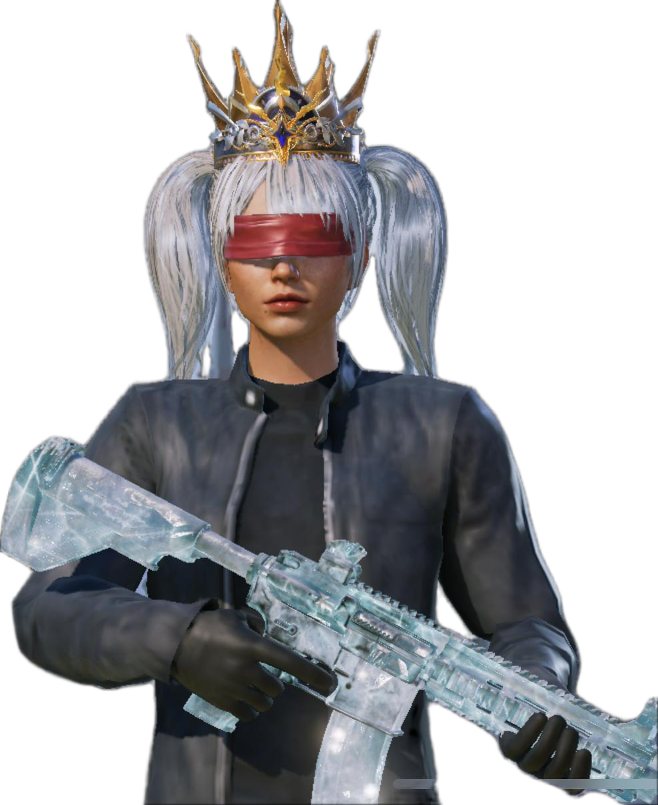

<html lang="tr">
<head>
  <meta charset="UTF-8" />
  <meta name="viewport" content="width=device-width, initial-scale=1" />
  <title>ZZONE99</title>
  
</head>
<body>
  <!-- Loading Screen -->
  

    
    <h1 id="loading-text">ZZONE99</h1>
  

  <!-- Header / Tanıtım -->
  <header>
    <h1>ZZONE99</h1>
    
İlk olarak “Für die GANG” adıyla kurulan ekip, daha sonra “AREA323” adı altında yükselişini sürdürmüş, 
       bugün ise yepyeni bir vizyonla ZZONE99 adıyla yoluna devam etmektedir. 
       Hedefimiz sadece oyun kazanmak değil, aynı zamanda kaliteli bir topluluk oluşturmak.

  </header>

  <!-- Liderler -->
  <section class="liderler">
    <h2>LİDERLER</h2>
    

      

        
        
mAzz99

        
516572604

      

      

        
        
yAzz99

        
520654025

      

    

    

      
      
    

  </section>

  <!-- Butonlar -->
  

    <button id="openFormBtn">KLANA KATIL</button>
  

  <!-- Başvuru Formu Popup -->
  

    <h3>Klana Katıl Başvurusu</h3>
    <form id="application-form" action="https://formspree.io/f/xldnljve" method="POST">
      <input type="text" name="uid" placeholder="UID" required autocomplete="off" />
      <input type="text" name="oyun_ismi" placeholder="Oyun İsmi" required autocomplete="off" />
      <input type="text" name="isim" placeholder="İsim" required autocomplete="off" />
      <input type="number" name="yas" placeholder="Yaş" min="10" max="80" required autocomplete="off" />
      <select name="cihaz" required>
        <option value="" disabled selected>Cihaz</option>
        <option value="Android">Android</option>
        <option value="iOS">iOS</option>
        <option value="Diğer">Diğer</option>
      </select>
      <select name="aktiflik" required>
        <option value="" disabled selected>Aktiflik</option>
        <option value="Haftada 7 Gün">Haftada 7 Gün</option>
        <option value="Haftada 4-6 Gün">Haftada 4-6 Gün</option>
        <option value="Haftada 1-3 Gün">Haftada 1-3 Gün</option>
      </select>
      <button type="submit">Başvuruyu Gönder</button>
    </form>
    

  

  <!-- Ziyaretçi sayacı -->
  

    

    
0

  

  
</body>

