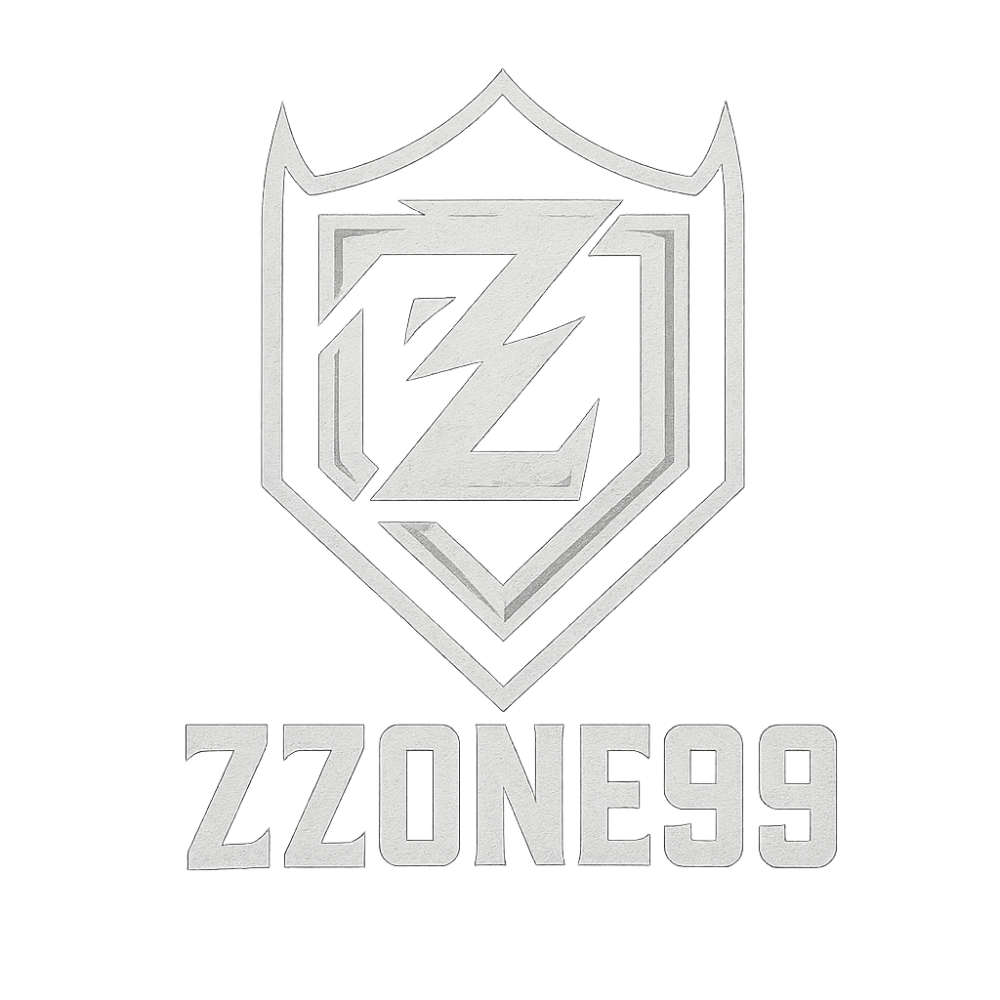

<!DOCTYPE html><html lang="tr">
<head>
  <meta charset="UTF-8">
  <meta name="viewport" content="width=device-width, initial-scale=1.0">
  <title>ZZONE99 Clan</title>
  
</head>
<body>
  <header>
    
    <h1>ZZONE99</h1>
    
ZAFER BİZİM ZONEMİZDE YAZILIR!

  </header>  <section class="members">
    <h2>Üyeler</h2>
    <ul class="member-list">
      <li><strong>mAzz99</strong> - Lider</li>
      <li><strong>yAzz99</strong> - Lider</li>
      <li><strong>iSzz99</strong> - Yönetici</li>
    </ul>
  </section>  <section class="form-section">
    <h2>Başvuru Formu</h2>
    <form action="https://formspree.io/f/xkgbzjqp" method="POST">
      <input type="text" name="name" placeholder="İsmin" required />
      <input type="text" name="uid" placeholder="PUBG UID" required />
      <textarea name="reason" placeholder="Neden katılmak istiyorsun?" required></textarea>
      <button type="submit">Başvur</button>
    </form>
  </section>  

    <a href="https://www.tiktok.com/@mAzz99theboss" target="_blank">@mAzz99theboss</a>
    <a href="https://www.tiktok.com/@babavizyondapm" target="_blank">@babavizyondapm</a>
  
  <footer>
    &copy; 2025 ZZONE99 Klanı. Tüm hakları saklıdır.
  </footer>
</body>
</html>
